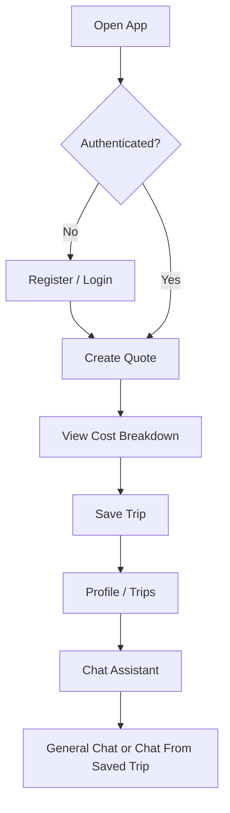
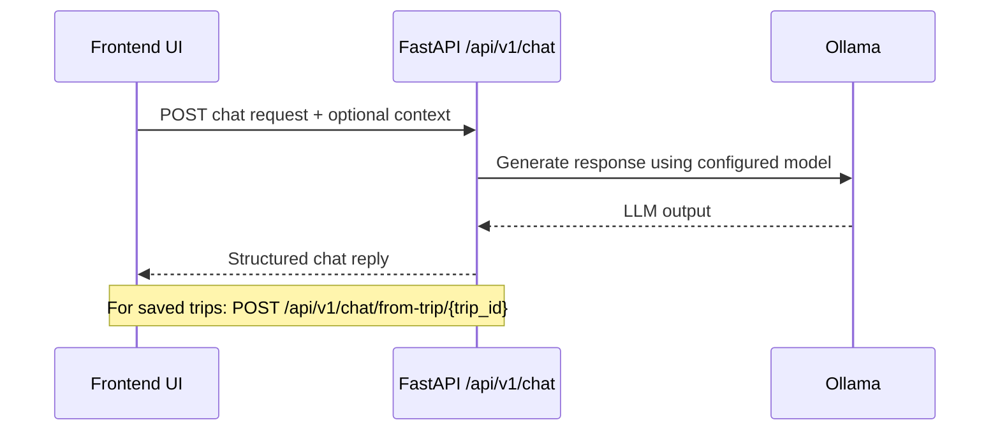

# Travel Buddy

Travel Buddy is a full-stack travel planning app with trip quote estimation, authentication, saved trips, and an AI travel assistant powered by Ollama.

## Highlights

- Secure auth flow (register/login/logout/me) with JWT cookie sessions
- Trip quote engine with date/city/traveler validation and detailed cost breakdown
- Saved trips (create, list, get, update) per user
- AI chat assistant for general travel Q&A and trip-context responses
- Multi-page frontend with modern pastel UI and resizable chatbot panel
- FastAPI backend with structured logging, error handling, security headers, and tests

## Tech Stack

- Frontend: HTML, CSS, Vanilla JavaScript
- Backend: FastAPI, Uvicorn, SQLModel, Pydantic
- Auth/Security: python-jose (JWT), passlib+bcrypt, CORS, CSP/security headers
- Database: SQLite (default), PostgreSQL-ready via `DATABASE_URL`
- AI: Ollama local LLM provider (configurable model)
- Dev/Test: Pytest, Docker, Docker Compose

## Architecture

```mermaid
flowchart LR
    U[User Browser] --> FE[Frontend Pages]
    FE --> API[FastAPI API]
    API --> DB[(SQLite / SQLModel)]
    API --> LLM[Ollama API]

    subgraph Frontend
      FE1[index.html]
      FE2[login.html]
      FE3[profile.html]
      FE4[trips.html]
      FE5[edit-trip.html]
    end

    FE --- FE1
    FE --- FE2
    FE --- FE3
    FE --- FE4
    FE --- FE5

    subgraph API Modules
      A1[/api/v1/auth]
      A2[/api/v1/quote]
      A3[/api/v1/trips]
      A4[/api/v1/chat]
    end

    API --- A1
    API --- A2
    API --- A3
    API --- A4
```

## Main User Flow



## AI Chat Flow



## Project Structure

```text
Travel buddy/
├── backend/
│   ├── app/
│   │   ├── api/v1/        # auth, quote, trips, chat endpoints
│   │   ├── auth/          # JWT + password utilities
│   │   ├── core/          # config
│   │   ├── db/            # session + DB init
│   │   ├── providers/     # transport pricing provider abstraction
│   │   ├── services/      # pricing + llm services
│   │   ├── main.py        # FastAPI entrypoint + frontend serving
│   │   ├── models.py      # User, SavedTrip, CityStats
│   │   └── schemas.py     # API contracts
│   ├── tests/
│   ├── requirements.txt
│   ├── Dockerfile
│   └── docker-compose.yml
├── frontend/
│   ├── index.html
│   ├── login.html
│   ├── profile.html
│   ├── trips.html
│   ├── edit-trip.html
│   └── static/
└── README.md
```

## Quick Start (Recommended)

### 1) Create and activate virtual environment (Windows PowerShell)

```powershell
python -m venv .venv
& ".\.venv\Scripts\Activate.ps1"
```

### 2) Install backend dependencies

```powershell
cd backend
pip install -r requirements.txt
```

### 3) Configure environment

Use `backend/.env` (already present) or copy from template:

```powershell
Copy-Item .env.example .env
```

Key AI settings:

- `LLM_PROVIDER=ollama`
- `OLLAMA_BASE_URL=http://localhost:11434`
- `OLLAMA_MODEL=qwen2.5:3b`

### 4) Start Ollama and pull model

```powershell
ollama pull qwen2.5:3b
ollama serve
```

If `ollama serve` says port 11434 is already in use, Ollama is already running.

### 5) Start backend

```powershell
cd backend
$env:PYTHONPATH='.'
uvicorn app.main:app --host 127.0.0.1 --port 8000
```

### 6) Open app

- App: http://127.0.0.1:8000/
- Login: http://127.0.0.1:8000/login
- Swagger: http://127.0.0.1:8000/docs

## Docker Option (Backend)

From `backend/`:

```powershell
docker compose up --build
```

Then open http://127.0.0.1:8000.

## API Summary

### Health
- `GET /health`

### Auth
- `POST /api/v1/auth/register`
- `POST /api/v1/auth/login`
- `POST /api/v1/auth/logout`
- `GET /api/v1/auth/me`

### Quotes
- `POST /api/v1/quote`

### Trips
- `POST /api/v1/trips`
- `GET /api/v1/trips`
- `GET /api/v1/trips/{trip_id}`
- `PUT /api/v1/trips/{trip_id}`

### Chat
- `GET /api/v1/chat/health`
- `POST /api/v1/chat`
- `POST /api/v1/chat/from-trip/{trip_id}`

## Testing

Run from `backend/`:

```powershell
$env:PYTHONPATH='.'
pytest -q
```

Current tests include quote and chat coverage in `backend/tests/`.

## Notes

- Frontend is served directly by FastAPI routes (`/`, `/login`, `/profile`, `/trips`, `/edit-trip`).
- Keep local runtime files like `.env`, `travel.db`, and `__pycache__` out of commits.
