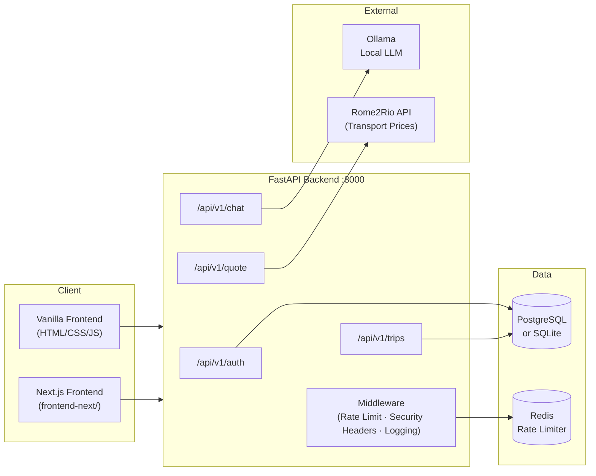
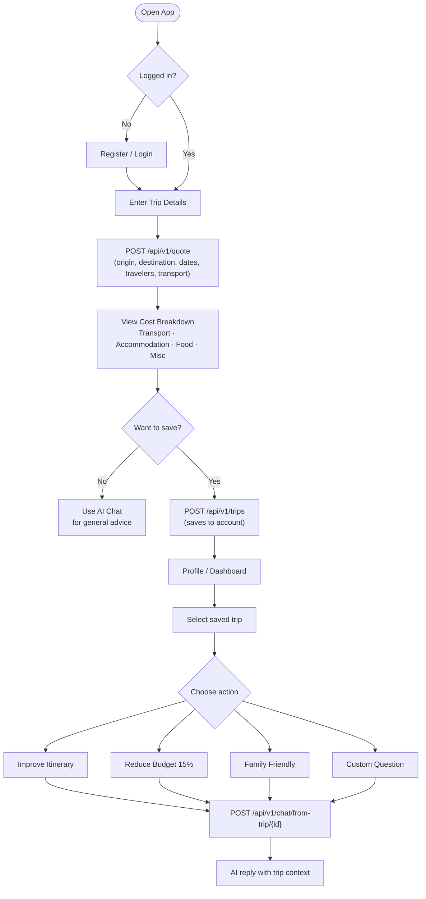
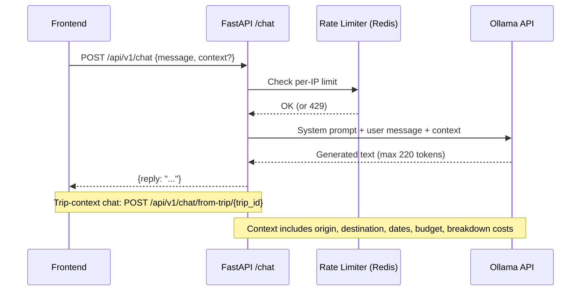
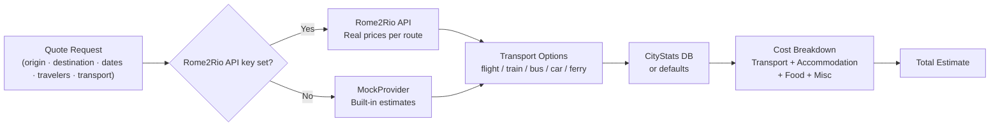
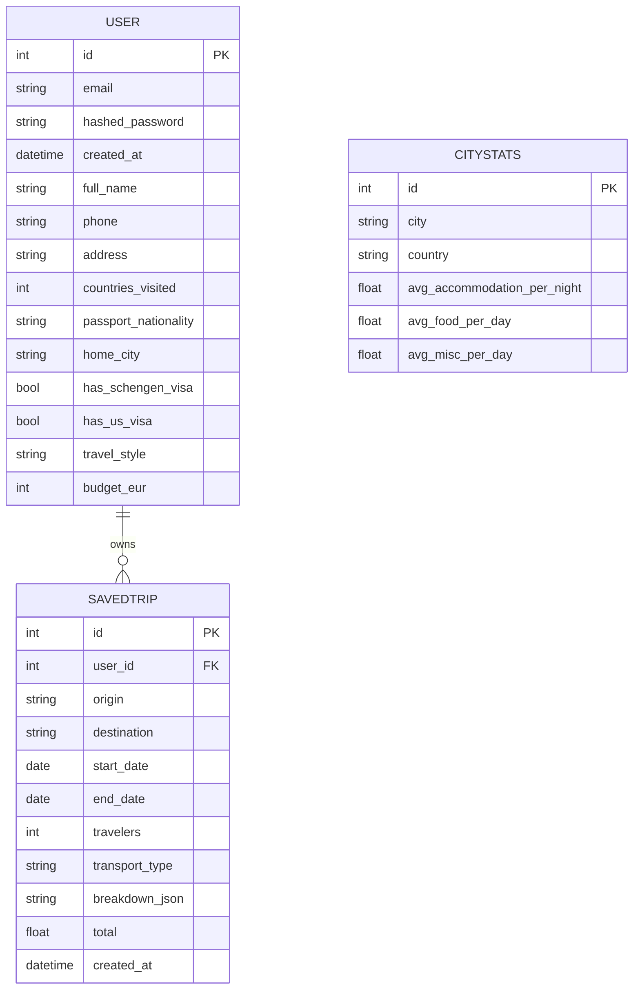

# Travel Buddy

Travel Buddy is a full-stack travel planning platform. Enter your trip details, get a real cost breakdown (flights, trains, accommodation, food), save trips to your profile, and get AI-powered advice via a built-in chat assistant powered by a local Ollama LLM.

---

## What It Does

| Feature | Description |
|---|---|
| **Trip Quote Engine** | Enter origin, destination, dates, travelers, and transport preference — get a full cost breakdown instantly |
| **Real Transport Pricing** | Optionally connects to the Rome2Rio API for live flight/train/bus/car/ferry prices; falls back to smart mock data |
| **Saved Trips** | Authenticated users can save, view, and revisit past trip estimates |
| **Traveler Profile** | Store your passport nationality, visa status, home city, travel style, and budget |
| **AI Chat Assistant** | Context-aware Ollama chat: ask general travel questions or get advice tailored to a specific saved trip |
| **Trip Actions** | Ask the AI to improve your itinerary, cut 15% off your budget, or make a trip family-friendly |
| **Rate Limiting** | Per-IP rate limiting on chat endpoints, backed by Redis in production |
| **Production-ready** | Docker Compose stack: FastAPI + PostgreSQL + Redis + Next.js frontend + optional local Ollama |

---

## Architecture


```mermaid
flowchart LR
    subgraph Client
        VFE["Vanilla Frontend\n(HTML/CSS/JS)"]
        NFE["Next.js Frontend\n(frontend-next/)"]
    end

    subgraph Backend["FastAPI Backend :8000"]
        A1["/api/v1/auth"]
        A2["/api/v1/quote"]
        A3["/api/v1/trips"]
        A4["/api/v1/chat"]
        MW["Middleware\n(Rate Limit · Security Headers · Logging)"]
    end

    subgraph Data
        DB[(PostgreSQL\nor SQLite)]
        RD[(Redis\nRate Limiter)]
    end

    subgraph External
        OL["Ollama\nLocal LLM"]
        R2R["Rome2Rio API\n(Transport Prices)"]
    end

    VFE --> Backend
    NFE --> Backend
    Backend --> MW
    A1 --> DB
    A2 --> R2R
    A3 --> DB
    A4 --> OL
    MW --> RD
```

---

## Main User Journey


```mermaid
flowchart TD
    A([Open App]) --> B{Logged in?}
    B -- No --> C[Register / Login]
    C --> D[Enter Trip Details]
    B -- Yes --> D

    D --> E["POST /api/v1/quote\n(origin, destination, dates, travelers, transport)"]
    E --> F[View Cost Breakdown\nTransport · Accommodation · Food · Misc]

    F --> G{Want to save?}
    G -- No --> H[Use AI Chat\nfor general advice]
    G -- Yes --> I["POST /api/v1/trips\n(saves to account)"]

    I --> J[Profile / Dashboard]
    J --> K[Select saved trip]
    K --> L{Choose action}

    L --> L1[Improve Itinerary]
    L --> L2[Reduce Budget 15%]
    L --> L3[Family Friendly]
    L --> L4[Custom Question]

    L1 & L2 & L3 & L4 --> M["POST /api/v1/chat/from-trip/{id}"]
    M --> N[AI reply with trip context]
```

---

## AI Chat Flow


```mermaid
sequenceDiagram
    participant UI as Frontend
    participant API as FastAPI /chat
    participant RL as Rate Limiter (Redis)
    participant LLM as Ollama API

    UI->>API: POST /api/v1/chat {message, context?}
    API->>RL: Check per-IP limit
    RL-->>API: OK (or 429)
    API->>LLM: System prompt + user message + context
    LLM-->>API: Generated text (max 220 tokens)
    API-->>UI: {reply: "..."}

    Note over UI,API: Trip-context chat: POST /api/v1/chat/from-trip/{trip_id}
    Note over API,LLM: Context includes origin, destination, dates, budget, breakdown costs
```

---

## Pricing Flow


```mermaid
flowchart LR
    Q["Quote Request\n(origin · destination · dates · travelers · transport)"]
    Q --> T{Rome2Rio API key set?}
    T -- Yes --> R2R["Rome2Rio API\nReal prices per route"]
    T -- No --> MOCK["MockProvider\nBuilt-in estimates"]
    R2R --> OPTS[Transport Options\nflight / train / bus / car / ferry]
    MOCK --> OPTS
    OPTS --> CITY[CityStats DB\nor defaults]
    CITY --> BREAK["Cost Breakdown\nTransport + Accommodation\n+ Food + Misc"]
    BREAK --> TOTAL[Total Estimate]
```

---

## Data Model


```mermaid
erDiagram
    USER {
        int id PK
        string email
        string hashed_password
        datetime created_at
        string full_name
        string phone
        string address
        int countries_visited
        string passport_nationality
        string home_city
        bool has_schengen_visa
        bool has_us_visa
        string travel_style
        int budget_eur
    }

    SAVEDTRIP {
        int id PK
        int user_id FK
        string origin
        string destination
        date start_date
        date end_date
        int travelers
        string transport_type
        string breakdown_json
        float total
        datetime created_at
    }

    CITYSTATS {
        int id PK
        string city
        string country
        float avg_accommodation_per_night
        float avg_food_per_day
        float avg_misc_per_day
    }

    USER ||--o{ SAVEDTRIP : "owns"
```

---

## Tech Stack

| Layer | Technology |
|---|---|
| **Vanilla Frontend** | HTML5, CSS3, Vanilla JavaScript |
| **Next.js Frontend** | Next.js (in `frontend-next/`) |
| **Backend** | FastAPI, Uvicorn, SQLModel, Pydantic v2 |
| **Auth** | python-jose (JWT HS256), passlib + bcrypt, httponly cookies |
| **Database** | SQLite (dev) / PostgreSQL 16 (prod) |
| **Migrations** | Alembic |
| **AI / LLM** | Ollama (local), configurable model (default: `qwen2.5:3b`) |
| **Transport Prices** | Rome2Rio API (optional) / MockProvider fallback |
| **Rate Limiting** | slowapi: in-memory (dev) or Redis-backed (prod) |
| **Cache / Queue** | Redis 7 |
| **Containerisation** | Docker, Docker Compose |
| **Security** | CSP, X-Frame-Options, X-Content-Type-Options, CORS |

---

## Project Structure

```text
Travel buddy/
├── backend/
│   ├── app/
│   │   ├── api/v1/
│   │   │   ├── auth.py          # register, login, logout, me, patch
│   │   │   ├── quote.py         # trip cost estimation
│   │   │   ├── trips.py         # saved trips CRUD
│   │   │   └── chat.py          # general chat + from-trip chat
│   │   ├── auth/
│   │   │   └── security.py      # JWT + bcrypt helpers
│   │   ├── core/
│   │   │   └── config.py        # settings (env-driven)
│   │   ├── db/
│   │   │   └── session.py       # DB engine + session
│   │   ├── providers/
│   │   │   ├── base.py          # abstract transport provider
│   │   │   ├── mock_provider.py # built-in estimates
│   │   │   └── rome2rio_provider.py  # Rome2Rio API client
│   │   ├── services/
│   │   │   ├── pricing.py       # cost breakdown logic
│   │   │   └── llm.py           # Ollama LLM client + queue
│   │   ├── main.py              # FastAPI app, middleware, static serving
│   │   ├── models.py            # User, SavedTrip, CityStats (SQLModel)
│   │   └── schemas.py           # Pydantic request/response schemas
│   ├── alembic/
│   │   └── versions/            # DB migration scripts
│   ├── tests/
│   ├── requirements.txt
│   ├── Dockerfile
│   └── .env
├── frontend/                    # Vanilla HTML/CSS/JS frontend
│   ├── index.html               # Landing page + quote form
│   ├── login.html
│   ├── profile.html             # Dashboard + saved trips
│   ├── trips.html
│   ├── edit-trip.html
│   └── static/
│       ├── app.js
│       ├── profile.js
│       └── styles.css
├── frontend-next/               # Next.js frontend (separate stack)
├── docker-compose.yml           # Full stack: backend + postgres + redis + frontend
└── README.md
```

---

## Quick Start (Local Development)

### 1. Create virtual environment

```bash
python -m venv .venv
source .venv/Scripts/activate    # Windows bash
# or
& ".\.venv\Scripts\Activate.ps1" # PowerShell
```

### 2. Install backend dependencies

```bash
cd backend
pip install -r requirements.txt
```

### 3. Configure environment

Edit `backend/.env` (already present). Key settings:

```env
# Database — SQLite for local dev
DATABASE_URL=sqlite:///./travel.db

# JWT
JWT_SECRET_KEY=change-me-in-production
JWT_ACCESS_TOKEN_EXP_MINUTES=60

# LLM (Ollama)
LLM_PROVIDER=ollama
OLLAMA_BASE_URL=http://localhost:11434
OLLAMA_MODEL=qwen2.5:3b

# Transport pricing (leave blank to use mock data)
ROME2RIO_API_KEY=

# Rate limiting
API_RATE_LIMIT_ENABLED=true
API_RATE_LIMIT_BACKEND=memory   # use "redis" in production
```

### 4. Start Ollama and pull model

```bash
ollama pull qwen2.5:3b
ollama serve   # skip if already running on :11434
```

### 5. Run the backend

```bash
cd backend
PYTHONPATH=. uvicorn app.main:app --host 127.0.0.1 --port 8000 --reload
```

### 6. Open the app

| URL | Page |
|---|---|
| http://127.0.0.1:8000/ | Landing / Quote |
| http://127.0.0.1:8000/login | Login / Register |
| http://127.0.0.1:8000/profile | Dashboard |
| http://127.0.0.1:8000/docs | Swagger UI |

---

## Docker (Full Stack)

Runs backend + PostgreSQL + Redis + Next.js frontend together.

```bash
docker compose up --build
```

To also run Ollama inside Docker (GPU/CPU):

```bash
docker compose --profile ai up --build
```

Services:

| Service | Port | Notes |
|---|---|---|
| `backend` | 8000 | FastAPI; connects to Postgres + Redis |
| `frontend` | 3000 | Next.js frontend |
| `postgres` | 5432 | PostgreSQL 16, persistent volume |
| `redis` | 6379 | Redis 7, used for rate limiting |
| `ollama` | 11434 | Optional (`--profile ai`) |

---

## API Reference

### Health

```
GET  /health
```

### Auth

```
POST  /api/v1/auth/register      Register new account (sets JWT cookie)
POST  /api/v1/auth/login         Login (sets JWT cookie)
POST  /api/v1/auth/logout        Clear session cookie
POST  /api/v1/auth/signup        Alias for register (Next.js frontend)
GET   /api/v1/auth/me            Get current user profile
PATCH /api/v1/auth/me            Update traveler profile fields
```

**Profile fields (PATCH /me):**
`full_name`, `phone`, `address`, `countries_visited`, `passport_nationality`, `home_city`, `has_schengen_visa`, `has_us_visa`, `travel_style` (`budget`/`mid`/`luxury`), `budget_eur`

### Quote

```
POST  /api/v1/quote
```

Request body:
```json
{
  "origin": "London",
  "destination": "Paris",
  "start_date": "2026-06-01",
  "end_date": "2026-06-05",
  "travelers": 2,
  "transport_type": "any"
}
```

Validation rules:
- `start_date` ≥ today
- `end_date` ≥ `start_date`
- Trip duration ≤ 365 days
- `travelers` 1–20
- `origin` ≠ `destination`

### Trips (requires auth)

```
POST  /api/v1/trips              Save a quoted trip
GET   /api/v1/trips              List all saved trips
GET   /api/v1/trips/{id}         Get single trip
PUT   /api/v1/trips/{id}         Update trip
```

### Chat

```
GET   /api/v1/chat/health               Check Ollama status
POST  /api/v1/chat                      General travel chat
POST  /api/v1/chat/from-trip/{trip_id}  Trip-context chat (requires auth)
```

**Trip-context actions** (`action` field):

| Action | What the AI does |
|---|---|
| `general` | General advice using trip data as context |
| `improve_itinerary` | Day-by-day itinerary suggestions |
| `reduce_budget_15` | Strategies to cut costs by 15% |
| `family_friendly` | Adjusts recommendations for families with kids |

---

## Environment Variables Reference

### Database
| Variable | Default | Description |
|---|---|---|
| `DATABASE_URL` | `sqlite:///./travel.db` | SQLite or PostgreSQL URL |
| `DB_AUTO_CREATE_TABLES` | `true` | Auto-create tables on startup |

### Auth / JWT
| Variable | Default | Description |
|---|---|---|
| `JWT_SECRET_KEY` | `secret` | Signing key — change in production |
| `JWT_ALGORITHM` | `HS256` | JWT algorithm |
| `JWT_ACCESS_TOKEN_EXP_MINUTES` | `60` | Token lifetime |
| `AUTH_COOKIE_NAME` | `travel_buddy_token` | Cookie name |
| `AUTH_COOKIE_SECURE` | `false` | Set `true` in production (HTTPS) |

### LLM / Ollama
| Variable | Default | Description |
|---|---|---|
| `OLLAMA_BASE_URL` | `http://localhost:11434` | Ollama server URL |
| `OLLAMA_MODEL` | `qwen2.5:3b` | Model to use |
| `LLM_MAX_TOKENS` | `220` | Max tokens per response |
| `LLM_TIMEOUT_SECONDS` | `30` | Request timeout |
| `LLM_MAX_CONCURRENT_REQUESTS` | `2` | Concurrency limit |

### Pricing
| Variable | Default | Description |
|---|---|---|
| `ROME2RIO_API_KEY` | _(blank)_ | Leave blank to use mock pricing |
| `DEFAULT_ACCOMMODATION_PER_NIGHT` | `100` | USD fallback |
| `DEFAULT_FOOD_PER_DAY` | `35` | USD fallback per person |
| `DEFAULT_MISC_PER_DAY` | `20` | USD fallback per person |

### Rate Limiting
| Variable | Default | Description |
|---|---|---|
| `API_RATE_LIMIT_ENABLED` | `true` | Enable/disable |
| `API_RATE_LIMIT_BACKEND` | `memory` | `memory` or `redis` |
| `API_RATE_LIMIT_REQUESTS` | `120` | Requests per window |
| `API_RATE_LIMIT_WINDOW_SECONDS` | `60` | Window duration |
| `REDIS_URL` | `redis://localhost:6379/0` | Redis connection |

---

## Testing

```bash
cd backend
PYTHONPATH=. pytest -q
```

Tests cover the quote engine and chat endpoints (`backend/tests/`).

---

## Database Migrations

Migrations are managed with Alembic:

```bash
cd backend
alembic upgrade head          # Apply all migrations
alembic revision --autogenerate -m "description"  # Create new migration
```

---

## Notes

- The vanilla frontend (`frontend/`) is served directly by FastAPI at `/`, `/login`, `/profile`, `/trips`, `/edit-trip`.
- The Next.js frontend (`frontend-next/`) is a separate service running on port 3000, intended for the Docker Compose production setup.
- Keep `travel.db`, `.env`, and `__pycache__` out of version control (already in `.gitignore`).
- The chatbot widget is resizable — drag the left edge to resize. Width is remembered in `localStorage`.
